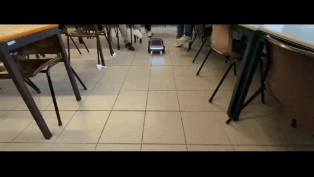
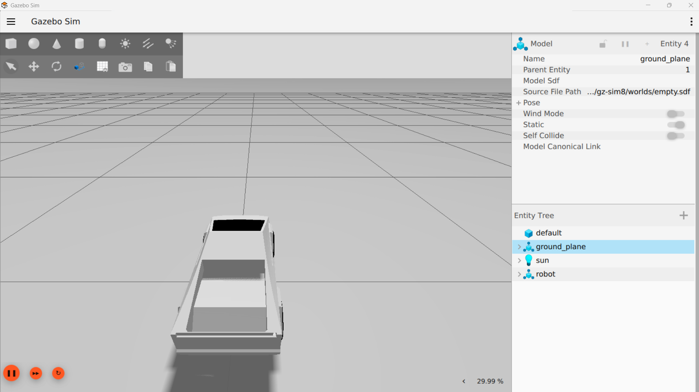
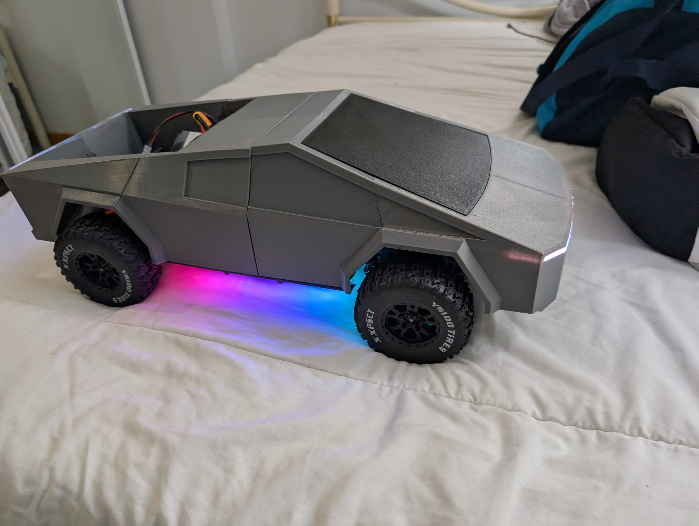

# 🛻 Cybertruck Simulation & Control



This project aims to simulate and control a 3D model of the **Tesla Cybertruck** using the **Gazebo** simulator, with real hardware integration via **Arduino** and **Raspberry Pi**, all orchestrated by **ROS 2**.

---

## 📸 Project Images

### Gazebo Simulation


### Physical Prototype


---

## 🧠 Objective

To create a simulation and control environment that allows the development and testing of autonomous or manual movement algorithms for a Cybertruck-type vehicle. The project aims to validate behavior in both the virtual environment (Gazebo) and interaction with real hardware.

---

## ⚙️ Technologies Used

-   **ROS 2 (Robot Operating System 2)** – Essential robotic middleware for communication between software components.
-   **Gazebo** – 3D simulator for robotic and vehicle environments, enabling precise virtual testing.
-   **C++** – Primary language for developing control logic and hardware interfaces.
-   **Python** – Used for launch scripts (launch files) and teleoperation nodes.
-   **Arduino** – Microcontroller for motor control, servos, and sensor readings on the physical prototype.
-   **Raspberry Pi** – Acts as a communication bridge between the ROS 2 environment on the main computer (where Gazebo runs) and the Arduino, as well as for on-board processing.
-   **ROS 2 Control** – Framework for robot control in ROS 2, integrating with both simulation and real hardware.
-   **URDF/XACRO** – Languages for kinematic and visual description of the Cybertruck model.
-   **STL Meshes** – 3D models of the Cybertruck parts for visualization in Gazebo and RViz.
-   **Serial Communication (USB)** – For direct communication between Raspberry Pi and Arduino.
-   **WSL (Windows Subsystem for Linux)** – Recommended development environment for Windows users.

---

## 🧩 Features

-   Faithful simulation of Cybertruck movement in Gazebo (acceleration, braking, steering, and wheel rotation control).
-   Integration with virtual sensors (Gazebo) and interface for real sensors (via Arduino).
-   Bidirectional communication between the simulation/control environment (ROS 2), Raspberry Pi, and Arduino.
-   Operation modes:
    -   **Manual Control:** Via keyboard or joystick for intuitive vehicle command.
    -   **Autonomous Control:** Preparation for the implementation of autonomous navigation algorithms or via scripts/sensors.
-   Export and logging of vehicle data (speed, acceleration, position, joint angles) for analysis and debugging.
-   Real-time visualization of the robot model and its states using RViz2.

---

## 📂 Project Structure

```
Cybertruck/
├── 📁 arduino/                    # (Arduino code for hardware communication)
├── 📁 assets/                     # (Images, diagrams, and other project resources)
├── 📁 src/                        # (ROS 2 packages source code for the robot)
│   ├── 📁 robot_description/      # (Defines the robot's model, URDF, meshes, and hardware interface)
│   ├── 📁 robot_sim/              # (Package for robot simulation in Gazebo)
│   └── 📁 teleop_mapper/          # (Package for robot teleoperation via keyboard and joystick)
├── 📄 commands_setupWS.txt        # (Useful commands for setting up the development workspace)
├── 📄 install_development.sh      # (Script to install development dependencies)
├── 📄 readme.md                   # (This project's README file)
└── 📄 uninstall_developement.sh   # (Script to uninstall development components)
```


## 🔧 How to Install and Run

### Prerequisites

-   **Ubuntu 22.04 LTS (Jammy Jellyfish)** or newer (recommended).
-   **ROS 2 Jazzy (or newer)**: Follow the official installation instructions for your operating system.
-   **Gazebo Garden/Ignition (or Fortress)**: If you are using ROS 2 Jazzy, Gazebo Garden is the default simulator. Ensure it's correctly installed and configured.
-   **CMake (version 3.16 or higher)**
-   **g++ (GNU C++ Compiler)**
-   **Arduino IDE**: To upload code to the Arduino.
-   **Raspberry Pi OS (Linux)**: For the Raspberry Pi.
-   **`libserial-dev`**: Required library for serial communication in C++. Install via `sudo apt install libserial-dev`.
-   **`ros-jazzy-ros2-control` and `ros-jazzy-ros2-controllers`**: Essential for ROS 2 Control.

### Workspace Setup

1.  **Clone the repository:**
    ```bash
    git clone [https://github.com/MrTadeu/Cybertruck.git](https://github.com/MrTadeu/Cybertruck.git)
    cd Cybertruck
    ```
2.  **Install dependencies:**
    ```bash
    bash ./install_development.sh
    ```
    *Note: This script should handle `rosdep install` and other system-level dependencies.*

3.  **Build the workspace:**
    Ensure you are in the `~/Cybertruck/` directory (where `src` is located) and have a clean environment (no other ROS 2 workspace previously sourced).
    ```bash
    rm -rf build install log # Cleans previous builds for a fresh start
    colcon build --symlink-install
    ```

4.  **Source development environment:**
    This must be done in every new terminal you open to work with the project.
    ```bash
    source install/setup.bash # or setup.sh, depending on your shell and ROS distro
    ```
    *To verify the environment is correct:*
    ```bash
    echo $AMENT_PREFIX_PATH
    # Should include /home/$USER/Cybertruck/install
    ```
### Run commends

Use the `launch` files written in Python to run your desired components.


```bash
ros2 launch <packege name> <file name> [optional_parameters]
```
note: `packege name` = folder name  (e.g., `robot_sim`, `teleop_mapper`)

Examples:

- To launch the Gazebo simulation:
```bash
ros2 launch robot_sim sim.launch.py use_gazebo_ros2_control:=true use_sim_time:=true
```
- To launch keyboard teleoperation:
```bash
ros2 launch teleop_mapper teleop_keyboard.launch.py
```